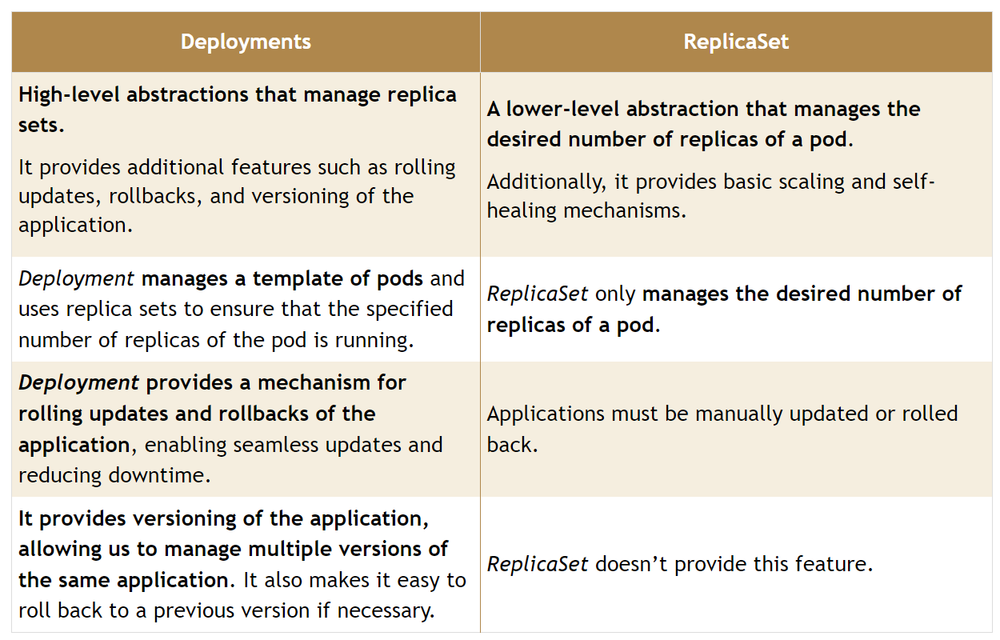
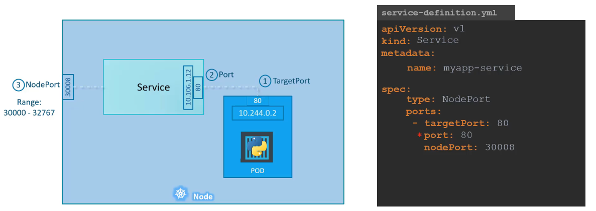
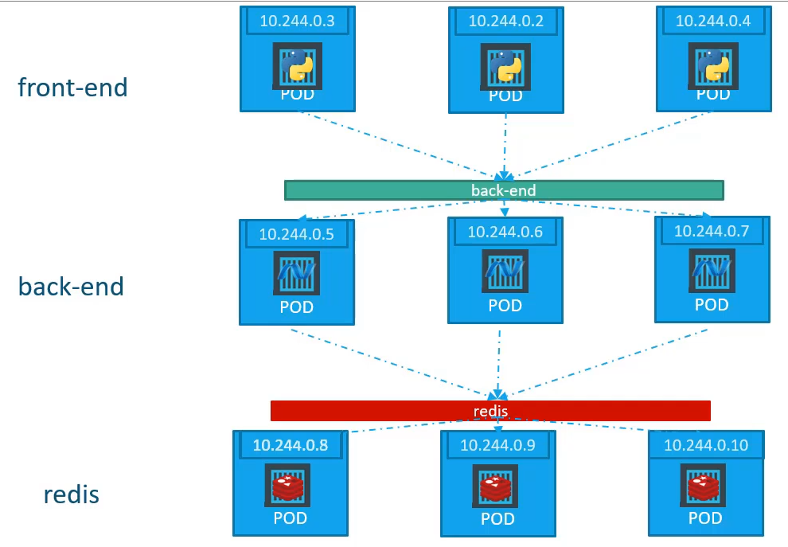
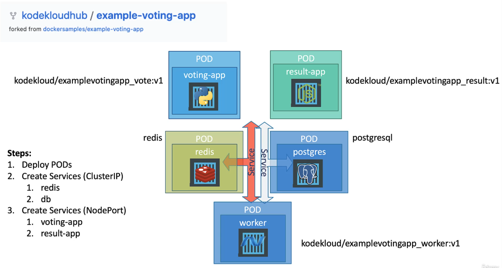

# LearnK8s

- A node may be a VM or physical machine, depending on the cluster.

- The scheduler distributes work or containers across multiple nodes.

- Have a good understanding of YAML files and when to use them:

- List, dictionary, List of Dictionaries.

## Pods:

- `kubectl get pods -o wide`

- `kubectl describe pods <POD_NAME>`

- `kubectl delete pod <POD_NAME> --grace-period=0`

- `kubectl get pod -o yaml`

- `kubectl run redis --image=redis123 --dry-run=client -o yaml > redis.yaml`

## Replication Controller vs Replica Set

- `kubectl get replicaset`

- `kubectl scale replicaset <REPLICASET_NAME> --replicas=2`

- `kubectl delete replicaset <REPLICASET_NAME>`

- Check for apiVersion: `kubectl api-resources | grep replicaset`

- `kubectl scale replicaset new-replica-set --replicas=0`

## Deployments [Deploy, Upgrade, Rolling Updates, Rollback, Pause, Resume]

- Rollout and Versioning

- Recreate (Face downtime) vs RollingUpdate (Take down one by one)

- Summarize Commands

  - `kubectl create –f <DEPLOYMENT_YAML_FILE>`

  - `kubectl get deployments`

  - `kubectl apply –f <DEPLOYMENT_YAML_FILE>`

  - `kubectl set image deployment/<DEPLOYMENT_NAME> <CONTAINER_NAME>=<NEW_IMAGE>`

  - `kubectl rollout status deployment/<DEPLOYMENT_NAME>`

  - `kubectl rollout history deployment/<DEPLOYMENT_NAME>`

  - `kubectl rollout undo deployment/<DEPLOYMENT_NAME>`

## Services

- Enable connectivity between a group of pods and an external source

- Node port, Cluster IP, Load Balancer

- Node Port:
  - Port range: 30000 to 32767
    
  - `minikube service myapp-svc --url`
- Cluster IP:
  - Default Setting
  - 
- Load Balancer:
  - Works as expected only with Cloud Providers like GCloud, AWS, Azure.
  - Otherwise act as Nodeport.

## MicroServices

- Check out the Voting App.
